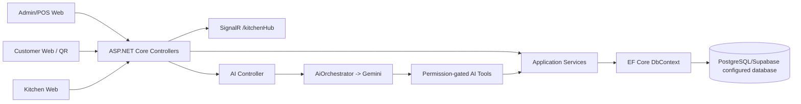

# System Overview

## Purpose

The repository implements a restaurant operations system with an admin/POS web app, a customer web app for table ordering and reservations, a kitchen display flow, branch-scoped operations, employee/attendance management, reporting, loyalty, expenses, receipt/settings management, and a Gemini-backed assistant. Payroll is outside the current system scope.

## Actors and modules

Actors evidenced by JWT roles and frontend flows are `admin`, `manager`, `employee`, `cashier`, `kitchen`, and `customer`. A guest can obtain a customer token through the phone-based customer-token endpoint, but the token still carries role `customer`.

Implemented modules include authentication, branches, employees, products/menu, toppings/options, promotions CRUD, tables/areas, reservations, POS orders, kitchen requests/history, payment recording, invoices, customers/loyalty, attendance, shifts/work schedules, expenses, receipt settings, system settings, notifications, dashboards/financial insights, and AI chat/tools. Payroll is not a current module; historical migration/docs references are retained separately.

High-level flow:

Evidence: `services/api/Program.cs`, `services/api/src/WebAPI/Controllers/`, `services/api/src/Application/Services/`, `apps/admin-web/src/App.tsx`, `apps/customer-web/src/App.tsx`.
