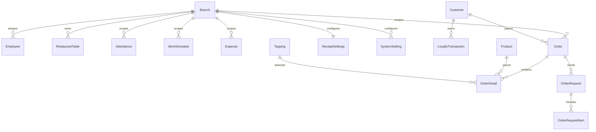

# Database Audit

## Active model

`ApplicationDbContext` exposes Product, Order, OrderDetail, Expense, Employee, RestaurantTable, Area, Branch, Attendance, WorkSchedule, Customer, Shift, Reservation, Topping, Promotion, OrderRequest, OrderRequestItem, Notification, ReceiptSettings, SystemSetting, LoyaltyTransaction and BusinessInsight sets (exact declarations are in `ApplicationDbContext.cs`). Payroll entities/DbSets are absent from the current model.

Important relationships/constraints:

- Order -> OrderDetail is one-to-many with cascade delete and shadow `OrderId` FK.
- Order -> OrderRequest and OrderRequest -> OrderRequestItem are one-to-many; request items cascade on request deletion.
- OrderDetail optionally references Product and Topping.
- Employee, RestaurantTable, Attendance, WorkSchedule and Expense reference Branch; Expense delete is restricted.
- Order optionally references Customer; LoyaltyTransaction references Customer and optionally Order.
- Customer phone is unique.
- ReceiptSettings has unique `BranchId`.
- SystemSetting has unique `(BranchId, Key)`.
- Loyalty transaction has a filtered unique `(OrderId, Type)` index where OrderId is not null.
- Order and analytics indexes include branch/time/status fields.

## Branch ownership

Branch-owned data is explicit for Employee, Table, Attendance, WorkSchedule, Expense, Order, ReceiptSettings, SystemSetting and BusinessInsight. Product/Area/Topping/Promotion do not consistently expose a BranchId in the domain model, so they appear shared across branches unless controller/service behavior imposes another rule. This is a material multi-branch design limitation to verify before claiming full tenant isolation.

## Migrations

The active-looking chain under `src/Infrastructure/Persistence/Migrations` begins with `20260721094114_InitialCreate` and includes kitchen requests, expenses, receipt settings, historical payroll migrations, system settings, financial snapshots, loyalty, roles and analytics indexes. Payroll migration references are historical/database-residual evidence only; no new destructive migration is created by this cleanup. There is also a separate migration directory and backup set; they must not be treated as a single applied history without database migration-table verification.

Evidence: `ApplicationDbContext.cs`, entity files, active migrations and model snapshot.
